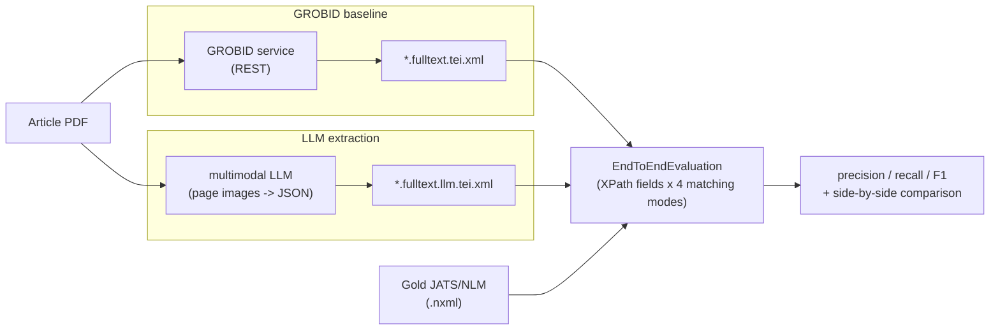

# grobid-llm-benchmark

AI-generated, reusable harness to benchmark **multimodal LLMs against GROBID** for structured data
extraction from scholarly PDFs, addressing
[grobidOrg/grobid#1146](https://github.com/grobidOrg/grobid/issues/1146).

## Idea

GROBID ships a Java end-to-end evaluation (`grobid-trainer`, `jatsEval`) that scores
extraction against gold JATS/NLM data using XPath field comparison under four matching
modes (strict, soft, Levenshtein, Ratcliff/Obershelp). Because scoring is XPath-based
against GROBID's own **TEI** structure, an LLM's output becomes *directly comparable* by:

1. Running an LLM over each article PDF (page images) to extract, as structured JSON,
   the same things GROBID's evaluation scores: header metadata, references, and the
   full-text structures (section titles, figure/table captions, and the in-text
   citation/figure/table call-out markers).
2. Rendering that JSON into **GROBID-schema TEI** dropped next to each PDF as
   `*.fulltext.llm.tei.xml`.
3. Scoring it with GROBID's *same* evaluation code via the `LLM` run type
   (`jatsEvalLLM`), so both columns share gold data, XPath fields, and matching modes —
   across all three scored groups (Header metadata, Citation metadata, Fulltext structures).



## Scope

The benchmark is designed to run over the **full** `PMC_sample_1943` set — the same corpus
behind GROBID's published numbers — so the GROBID column is comparable to the official
figures and the LLM column is measured at the same scale. Nothing is hardcoded to a sample:
every step iterates over all downloaded articles, and `--n` (or `N_ARTICLES`) only controls
how many are fetched. Use a small `--n` for a quick, cheap iteration loop; use the dataset's
full size (1943) for the real run.

## Compute & resources

The footprint depends on which parity level you target. Rough expectations for the full
1943-article run:

| Component | CPU / arch | Memory | Disk | Notes |
|---|---|---|---|---|
| Harness + `crf-lite` GROBID | any (arm64/amd64), 4+ cores | ~4 GB | ~2 GB | Smoke tests, wiring validation. Runs on a laptop. |
| `dl-parity` GROBID (DeLFT) | **amd64**, 8+ cores | 8–16 GB | ~8 GB (image + models) | Needed for published-parity numbers. GPU optional. |
| GPU for `dl-parity` | NVIDIA, ~6 GB VRAM | — | — | Optional; cuts full-run wall-clock from hours to tens of minutes. |
| `glutton-local` (biblio-glutton + Elasticsearch) | amd64, 4+ cores | 8+ GB (ES ~4 GB heap) | **~700 GB** free disk while extracting | Prebuilt reference DB from Hugging Face (~160 GB download that unpacks to a ~300 GB CrossRef LMDB + a ~34 GB / 162 M-doc ES index). biblio-glutton has **no published image** — build the jar from source (see [Consolidation](#consolidation)). |
| `ollama` (optional local LLM) | GPU strongly recommended | 8–16 GB | 2–20 GB per model | Only for the offline LLM backend. |

Practical guidance:

- **Baseline-only, published parity:** an amd64 VM with ~8 cores, 16 GB RAM, and a dedicated
  ~700 GB data disk for glutton (the ~160 GB Hugging Face download unpacks to ~330 GB of LMDB +
  ES index; keep both the archives and the extracted data during extraction). CPU-only is fine;
  expect a few hours for the DL run over 1943 articles.
- **Quick iteration:** any machine with the `crf-lite` profile and a small `--n`; no GPU or
  large disk needed.
- **LLM comparison via a hosted API:** compute is trivial locally (just PDF rendering and
  HTTP calls); the real cost is the API bill — run `glb estimate-cost --n 1943 --rate sonnet`
  first to budget it. Throughput is bounded by the provider's rate limits, not your hardware.

## Layout

- `src/grobid_llm_benchmark/`
  - `tei_schema.py` — the GROBID TEI XPaths the evaluation scores + the JSON contract.
  - `models.py` — Pydantic models for the LLM extraction result.
  - `pdf.py` — render PDF pages to images / extract the text layer.
  - `backends/` — pluggable LLM backends: `api_backend.py` (Azure OpenAI / OpenAI-compatible),
    `ollama_backend.py` (local), `mock_backend.py` (offline testing).
  - `tei_writer.py` — render extraction JSON into GROBID-schema TEI.
  - `grobid_client.py` — produce GROBID TEI via a running GROBID service.
  - `scorer.py` — run GROBID's evaluation on GROBID / LLM TEI.
  - `compare.py` — side-by-side GROBID-vs-LLM report.
  - `cost.py` — pre-run API cost estimate.
  - `dataset.py` / `runner.py` / `cli.py`.
- `deploy/` — docker-compose stack for running the whole benchmark on a VM.

## CLI

The target is the full `PMC_sample_1943` set (GROBID's published benchmark); use a smaller
`--n` for a quick sample while iterating.

Prerequisites: `poetry install`; a running GROBID service for `grobid-run` (see
[Deploy](#deploy-on-a-vm)); and a patched grobid checkout for `score` at `$GROBID_DIR` (or
`./grobid`) carrying the `jatsEval` / `jatsEvalLLM` tasks.

### Shared setup: dataset + GROBID baseline (run once)

GROBID's output (`*.fulltext.tei.xml`) and its score are produced independently of any LLM,
so you compute them **once** and reuse them as the fixed GROBID column for every LLM
comparison — you never re-run GROBID to evaluate a new model.

```bash
poetry install
DATA=./data/PMC_sample_1943
poetry run glb download-data --n 1943 --out "$DATA"
poetry run glb grobid-run --data "$DATA"                                   # -> *.fulltext.tei.xml
poetry run glb score grobid --data "$DATA" --out reports/grobid_report.md
```

### 1) GROBID benchmark repro

The shared setup above *is* the GROBID reproduction: `reports/grobid_report.md` holds
precision/recall/F1 comparable to GROBID's published numbers. For published parity, produce
the TEI with the `dl-parity` + `glutton-local` deploy profiles before scoring.

### 2) GROBID + cloud LLM

Set credentials (`AZURE_OPENAI_ENDPOINT` / `AZURE_OPENAI_API_KEY`, or `OPENAI_API_KEY` for an
OpenAI-compatible endpoint), budget the spend, then run + score + compare against the
already-computed GROBID report:

```bash
poetry run glb estimate-cost --n 1943 --rate gpt-4o --max-pages 12          # budget first
poetry run glb run   --data "$DATA" --backend azure --model gpt-4o --tag azure  # -> *.fulltext.llm.azure.tei.xml
poetry run glb score llm --data "$DATA" --tag azure --out reports/llm_azure_report.md
```

(Use `--backend openai` with `OPENAI_BASE_URL` for any OpenAI-compatible gateway.)

For **parity with GROBID on the fulltext structures** (section/figure/table titles and
in-text call-out markers, which are spread across the whole paper), `run` defaults to
`--max-pages 0`, i.e. it sends **every** page image so the LLM sees the entire document.
Cap it (`--max-pages 4`, first+last) for a cheaper header/citation-focused run — but then
mid-document fulltext recall drops. Size your budget with `estimate-cost --max-pages` set to
a realistic average page count.

### 3) GROBID + Ollama

Same shape against a local Ollama vision model — no API cost, and still no GROBID re-run.
A different `--tag` keeps its TEI alongside the cloud run's:

```bash
poetry run glb run   --data "$DATA" --backend ollama --model llama3.2-vision --tag ollama
poetry run glb score llm --data "$DATA" --tag ollama --out reports/llm_ollama_report.md
```

### Comparing several LLMs without re-running GROBID

The GROBID baseline is fully decoupled: `grobid-run` + `score grobid` produce
`reports/grobid_report.md` once, and every comparison reuses it verbatim as the GROBID column.

Backends are namespaced by `--tag`: each writes its own `*.fulltext.llm.<tag>.tei.xml` next to
the PDF (omit `--tag` for the canonical `*.fulltext.llm.tei.xml`), so cloud, Ollama, model A and
model B all coexist in one dataset dir without clobbering each other. `score llm --tag <tag>`
selects one backend's TEI (via GROBID's `-Pllmsuffix`) and writes a distinct report. Because each
backend's raw TEI persists, you can re-score any of them later — e.g. after a scorer change —
without paying to re-run the model.

`compare` treats **GROBID and the LLM as two peer baselines** scored against the same gold. With a
**single** `--llm-report` it emits a rich pairwise table — f1 **and** precision/recall for each
side, plus their f1 delta:

```bash
poetry run glb compare --grobid-report reports/grobid_report.md \
  --llm-report azure=reports/llm_azure_report.md
# -> reports/comparison_azure.md (filename derived from the backend; pass --out to override)
```

Pass **several** `--llm-report`s and it switches to a compact overview — GROBID's f1 plus an
`f1` + `Δ` (vs GROBID) column pair per backend, each compared pairwise against the shared GROBID
column:

```bash
poetry run glb compare --grobid-report reports/grobid_report.md \
  --llm-report azure=reports/llm_azure_report.md \
  --llm-report ollama=reports/llm_ollama_report.md
# -> reports/comparison_azure_ollama.md
```

Each `--llm-report` may be `label=path` (to name its column) or just a `path` (the label is then
derived from the filename). The output filename defaults to `reports/comparison_<backend...>.md`
(named after the compared backends), and the report's title/scope line likewise name the exact
backends and sections scored — pass `--out` to choose your own path.

## Deploy on a VM

The `deploy/` stack runs the full benchmark with docker-compose. Its primary job is
reproducing GROBID baselines; the LLM comparison is an add-on that needs API credentials.

```bash
cd deploy
cp .env.example .env          # edit values; keep secrets out of git
docker compose up --build     # crf-lite GROBID + harness; reproduces the baseline
```

The harness runs `run_benchmark.sh`: download the dataset -> GROBID baseline via the service ->
score baseline -> (if `BASELINE_ONLY=0`) LLM run + score + comparison. Artifacts land in
`deploy/reports/`. `N_ARTICLES` defaults to the full 1943; lower it for a quick sample.

### Profiles

- **default / `crf-lite`** — `grobid/grobid:0.9.0-crf` (multi-arch, ~477 MB). Boots on any
  host; use for smoke tests and wiring validation.
- **`dl-parity`** — `grobid/grobid:0.9.0-full` (DeLFT deep-learning models). Reproduces the
  published benchmark numbers. Requires an **amd64** host; a GPU is optional (enable with
  the `docker-compose.gpu.yml` override).
- **`glutton-local`** — local biblio-glutton + Elasticsearch for offline reference
  consolidation. biblio-glutton ships no Docker image, so the service runs the shadow jar
  built from source on a stock Temurin JRE; needs the prebuilt DB (see [Consolidation](#consolidation)).
- **`ollama`** — local Ollama for an offline LLM backend.

### Consolidation

GROBID consolidation matches parsed metadata against CrossRef (via glutton) and enriches it with
the canonical record — DOIs and clean fields. The benchmark uses a **local glutton**: run with
`--profile glutton-local` and `GLUTTON_URL=http://glutton:8080`. It's fully offline and
reproducible, but takes real setup — see below.

**Header consolidation is on, citation consolidation is off — and both matter for scoring.**
The harness defaults to `CONSOLIDATE_HEADER=1` + `CONSOLIDATE_CITATIONS=0`, matching GROBID's own
published PMC/bioRxiv/PLOS runs (`grobid-trainer` `EndToEndEvaluation`). Leave citation
consolidation off for any scored comparison: it overwrites parsed references with full-precision
CrossRef dates that the year-only JATS gold scores verbatim, which sharply deflates the citation
numbers. The LLM path takes the same `--glutton-url` /
`--consolidate-header` / `--consolidate-citations` knobs and `deploy/run_benchmark.sh` defaults
them to the GROBID values, so a scored run treats both tools identically. Per-flag semantics live
in `deploy/.env.example` and `glb run --help`.

(The public `https://cloud.science-miner.com/glutton` is only a rate-limited demo, unsuitable
for a full 1943-article run, and GROBID's JVM may reject its TLS cert with
`PKIX path building failed` on older images — so it isn't a supported path here.)

#### Setting up local glutton

biblio-glutton is **not published as a Docker image**, so the `glutton` service runs the
shadow ("onejar") jar built from source. There are three pieces: the jar, the LMDB stores, and
a prebuilt Elasticsearch index.

1. **Build the jar** (Java 11, ~1 min):

   ```bash
   git clone https://github.com/kermitt2/biblio-glutton
   cd biblio-glutton && ./gradlew --no-daemon clean shadowJar   # -> build/libs/lookup-service-0.3-SNAPSHOT-onejar.jar
   ```

2. **Fetch + extract the prebuilt DB** from Hugging Face
   ([`sciencialab/biblio-glutton-dbs`](https://huggingface.co/sciencialab/biblio-glutton-dbs),
   ~160 GB, 2024-04 CrossRef). The files are 7-Zip archives (`7z` required; CrossRef is a
   3-volume split zip). Prefer an authenticated `hf` download and disable the Xet engine, which
   can hang mid-file:

   ```bash
   HF_HUB_DISABLE_XET=1 hf download sciencialab/biblio-glutton-dbs --local-dir dl
   7z x dl/data/db/crossref.zip -oGLUTTON/db     # -> GLUTTON/db/crossref/data.mdb (~298 GB)
   for f in pmid hal unpayWall; do 7z x dl/data/db/$f.7z.001 -oGLUTTON/db; done
   7z x dl/biblio-glutton-index.7z.001 -oGLUTTON/index_src   # -> a bundled ES 8.15 install + data dir
   ```

   The ES **data** directory is `GLUTTON/index_src/biblio-glutton-index/elastic/elastico_singleNode/data`
   (holds the `glutton` index, 162 M docs). It was created by ES with security on; our ES container
   runs security-off + single-node and just reads the Lucene index — `chown -R 1000:0` it so the
   container user (uid 1000) can open it, and set `sysctl -w vm.max_map_count=262144` on the host.

3. **Point the stack at all three** via `.env` (see `deploy/.env.example`): `GLUTTON_JAR`,
   `GLUTTON_CONFIG` (a `glutton.yml` with `elastic.host: elasticsearch:9200`, `index: glutton`,
   `grobidHost: http://grobid:8070/api`, `storage: /opt/glutton/data/db`), `GLUTTON_DB_DIR`
   (the LMDB dir), and `GLUTTON_INDEX_DIR` (the ES data dir above). Then:

   ```bash
   docker compose --profile glutton-local up -d elasticsearch glutton
   curl "http://localhost:9200/_cat/indices?v"                  # expect a green 'glutton' index
   curl "http://localhost:8080/service/lookup?doi=10.1038/nature12373"   # smoke-test a lookup
   ```

### Baseline-only vs full comparison

- `BASELINE_ONLY=1` (default) — reproduce the GROBID baseline. No LLM credentials needed.
- `BASELINE_ONLY=0` — also run the LLM, score it, and build `comparison_<LLM_TAG>.md`. Set
  `LLM_BACKEND` (`azure` / `openai` / `ollama`), `LLM_MODEL`, and the matching credentials
  in `.env`.

Published-parity example on an amd64 VM:

```bash
docker compose --profile dl-parity --profile glutton-local up --build
```

## Tests

```bash
poetry run pytest -m offline     # unit + mock end-to-end + scorer smoke; no network/GPU/key
poetry run pytest -m docker      # compose lint + crf-lite service boot (needs docker)
```

## Licensing & attribution

MIT-licensed (see [`LICENSE`](LICENSE)). GROBID and biblio-glutton are Apache-2.0 and aren't
vendored here — they're fetched/built at image time. The one GROBID-derived file,
[`deploy/patches/llm-eval.patch`](deploy/patches/llm-eval.patch), stays Apache-2.0; see
[`NOTICE`](NOTICE) for details.
